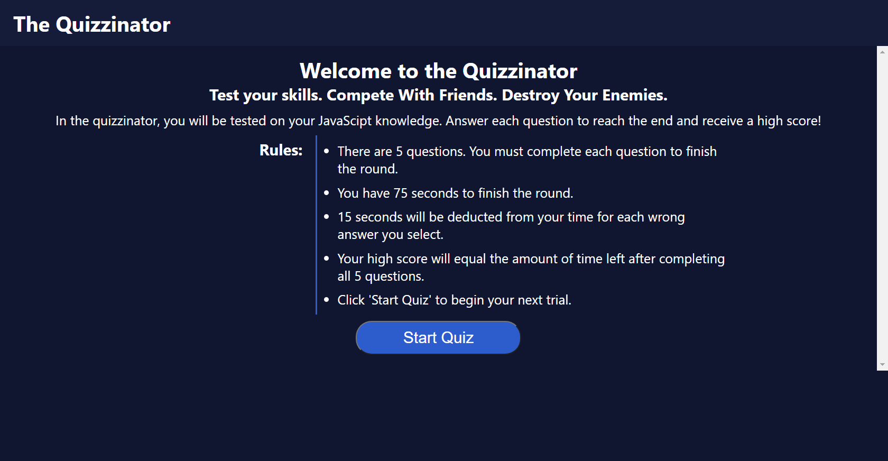
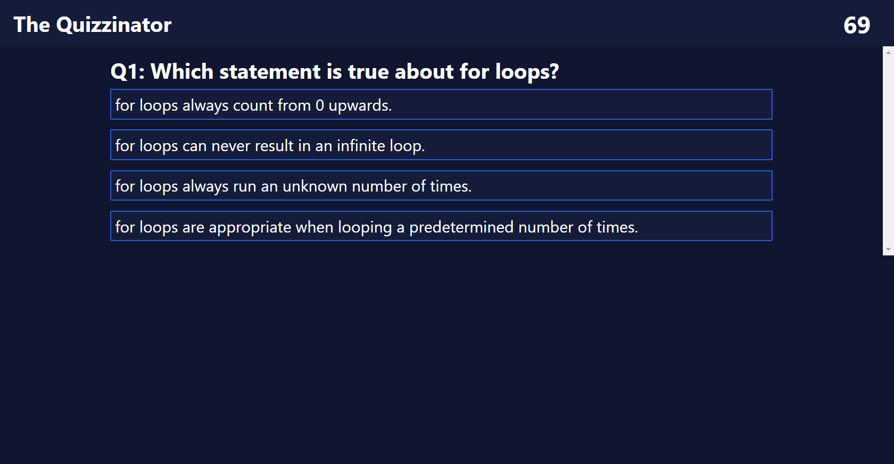
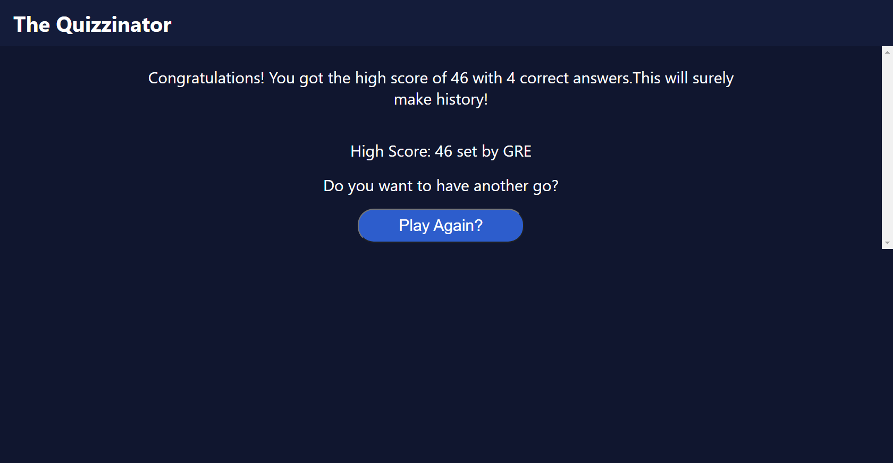

# Code Quiz <!-- omit in toc -->
- [Description](#description)
- [Demo](#demo)
- [Test Conditions and Grading Criteria](#test-conditions-and-grading-criteria)
  - [User Story](#user-story)
  - [Acceptance Criteria](#acceptance-criteria)
  - [Grading Requirements](#grading-requirements)
## Description
In this assignment, I was tasked with creating a quiz application. The application would dynamically change the content of the page without reloading the webpage.

I was able to practice many of the skills that I learned in the modules (and then some) with this project. Conceptually I think that accessing different objects and their methods is pretty easy, but with the new APIs we were using I found the information difficult to latch onto. I would have to keep referencing the module to ensure that I was using the correct syntax or ensure that the method I was calling did what I thought it did.

This was the first project I have done that involved actually writing my own HTML, CSS, and JS all the way through. I found this to be an invaluable refresher of CSS and HTML concepts that I did not look at for a few weeks.
## Demo
The live application can be deployed here: [The Quizzinator](https://glendonintendo.github.io/challenge4-code-quiz/)

Demo images of the deployed application are below:



## Test Conditions and Grading Criteria
### User Story
```
AS A coding boot camp student
I WANT to take a timed quiz on JavaScript fundamentals that stores high scores
SO THAT I can gauge my progress compared to my peers
```
### Acceptance Criteria
```
GIVEN I am taking a code quiz
WHEN I click the start button
THEN a timer starts and I am presented with a question
WHEN I answer a question
THEN I am presented with another question
WHEN I answer a question incorrectly
THEN time is subtracted from the clock
WHEN all questions are answered or the timer reaches 0
THEN the game is over
WHEN the game is over
THEN I can save my initials and score
```
### Grading Requirements
#### Technical Acceptance Criteria - 40% <!-- omit in toc -->
- [x] Has a timer that starts when the start button is clicked
- [x] Presents a new questions on starting and when previous question is answered
- [x] When an answer is incorrect, time is removed from the clock
- [x] Game ends when the timer reaches 0 or all questions are answered
- [x] When game ends, user is given a score equal to the time left on the clock
- [x] When game ends, user is given option to save initials with their high score
#### Deployment - 32% <!-- omit in toc -->
- [x] Application deployed at live URL
- [x] Application loads with no errors
- [x] Application GitHub URL submitted
- [x] GitHub repository contains application code
#### Application Quality - 15% <!-- omit in toc -->
- [x] Application user experience is intuitive and easy to navigate
- [x] Application user interface style is clean and polished
- [x] Application resembles the mock-up functionality provided in the Challenge instructions
#### Repository Quality  - 13% <!-- omit in toc -->
- [x] Repository has a unique name
- [x] Repository follows best practices for file structure and naming conventions
- [x] Repository follows best practices for class/id naming conventions, indentation, high-quality comments, etc.
- [x] Repository contains multiple dsecriptive commit messages
- [x] Repository contains a high-quality README file with description, screenshot, and link to deployed application